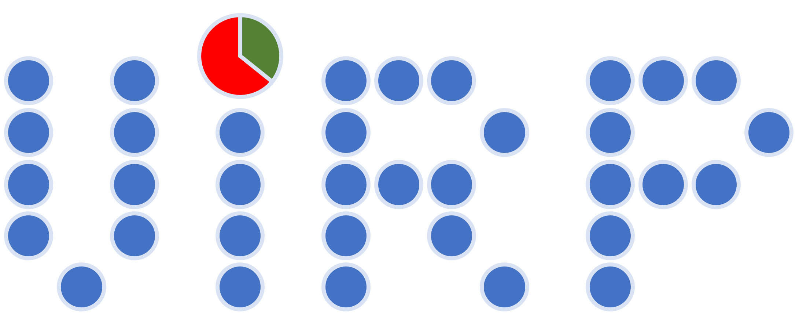

# Virp
 `virp` (VIRtual cell generation by Permutation) is a code for the fast generation of a virtual cell from a crystal structure (in CIF format) containing site disorder. It is named after Singapore's first superhero, VR Man, whose superpower is "Virping". The TV show was supposedly dogwater; we are still proud of him though.

 ## Theory
 (To be updated!)

 ## Requirements
 The only package required is Pymatgen (`pymatgen==2024.10.3`) 
 __Optional__: You can also use git for the fancy installation. Otherwise, downloading the .py file will do.

 ## Installation
 `pip install git+https://github.com/andypaulchen/virp.git`

 ## Versions and changelog
 `v0.1.1`: first workable code, with function to generate a virtual cell.  
 `v0.2.1`: added enumeration function  
 `v0.2.2`: enumeration can be imported now (fix)
 
